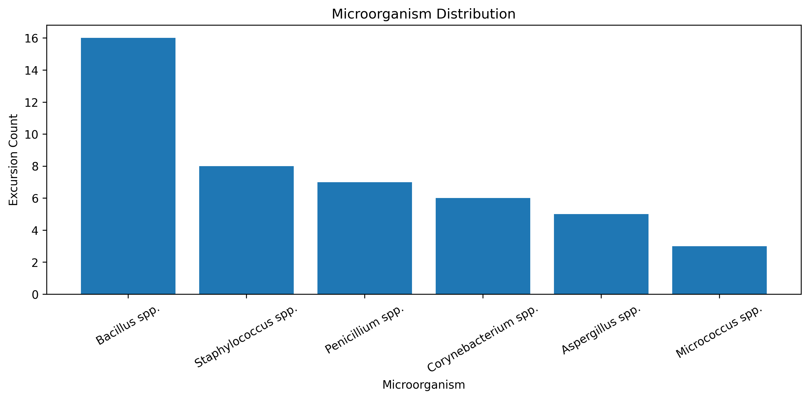
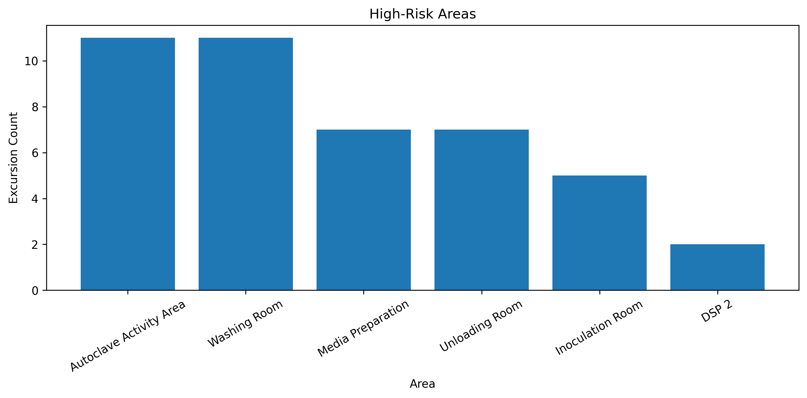
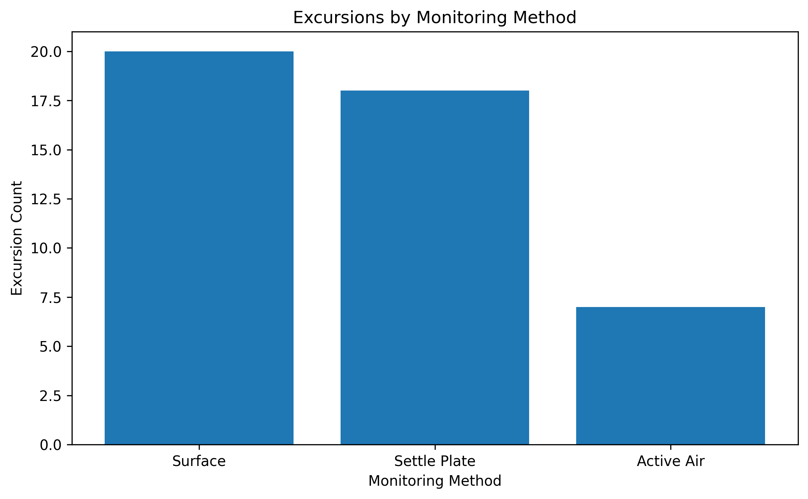
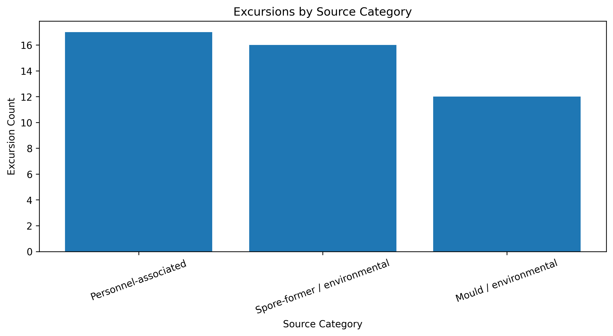
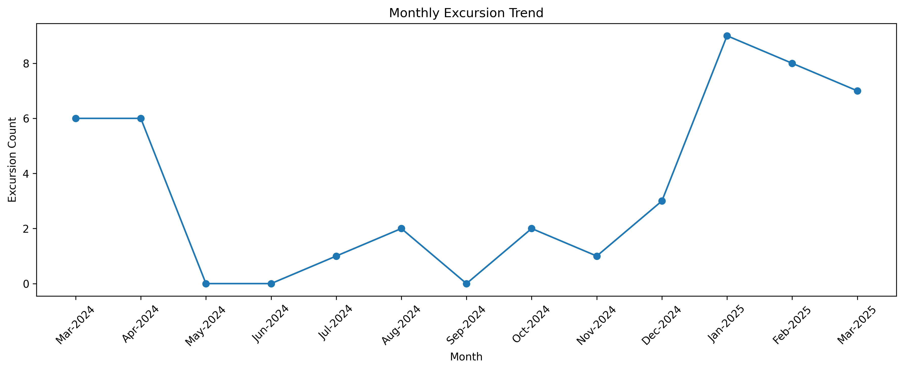

# Pharmaceutical Environmental Monitoring & Contamination Risk Analytics

## Project Overview

This project analyzes pharmaceutical Environmental Monitoring (EM) data to identify microbial contamination patterns, high-risk areas, recurring microorganisms, and contamination-risk events.

A Machine Learning model is used as a decision-support tool for early risk identification.

## Project Objectives

- Identify microbial contamination patterns.
- Identify high-risk areas and recurring microorganisms.
- Analyze contamination risk during operations.
- Develop an ML-based early-warning risk assessment.
- Support Environmental Monitoring, investigation and CAPA decisions.

## Project Workflow

EM Data → Data Cleaning → EDA → Microorganism Analysis → Risk Analysis → Feature Engineering → ML Model → Model Evaluation → Key Insights & Recommendations

## Dataset Summary

- Dataset: Pharmaceutical Environmental Monitoring (EM)
- Scope: Grade C and Grade D areas
- Monitoring: Settle Plate, Active Air Sampling, Surface Monitoring
- Conditions: At Rest and During Operation
- Target: Microbial contamination risk / excursion prediction

## Key Findings

- Grade C/D excursions were mainly observed During Operation.
- Bacillus spp. was the most frequent microorganism among excursions.
- High-risk areas included Autoclave Activity Area, Media Preparation, Inoculation Room and DSP 2.
- Most excursions were classified as High or Medium risk.
- The ML model showed high recall for identifying risk events.

## Risk & Control Strategy

The identified contamination patterns can be used to support a risk-based control strategy.

- Prioritize high-risk areas for focused Environmental Monitoring review.
- Strengthen During Operation monitoring and investigation of excursions.
- Investigate recurring microorganisms and their probable source categories.
- Review personnel practices, cleaning and disinfection, utilities, HVAC and equipment-related factors during investigations.
- Use contamination trends and ML predictions as decision-support inputs for investigation and CAPA.
- Specific corrective actions should follow validated site procedures, QA requirements and applicable regulatory controls.

## Project Limitations

- The dataset is limited to available Environmental Monitoring parameters.
- RH, temperature, HVAC and personnel data were not directly available for modelling.
- ML predictions should be treated as decision-support, not as a replacement for QA investigation or CAPA procedures.

## Project Scope & Dataset Context

- Focus: Grade C and Grade D Environmental Monitoring areas.
- Monitoring methods: Settle Plate, Active Air Sampling and Surface Monitoring.
- Conditions: At Rest and During Operation.
- Analysis focus: contamination patterns, microorganisms, risk areas and excursions.
- ML focus: early-warning contamination risk prediction.

## Final Conclusion

The Environmental Monitoring analysis identified key high-risk areas and microbial contamination patterns across Grade C and Grade D areas.

The tuned Random Forest model achieved a ROC-AUC of 0.712 and high recall of 0.973, indicating useful potential for identifying contamination-risk events.

The analysis can support:

- High-risk area prioritization
- During Operation monitoring focus
- Microorganism/source investigation
- Early-warning risk assessment

The ML model should be used as a decision-support tool along with established Environmental Monitoring, investigation, QA and CAPA procedures.
## Key Results

The analysis identified important microbial contamination patterns across Grade C and Grade D areas.

- 45 Grade C/D excursion records were identified.
- Bacillus spp. was the most frequently observed microorganism.
- High-risk areas included Autoclave Activity Area, Media Preparation, Inoculation Room and DSP 2.
- Most Grade C/D excursions occurred During Operation.
- Surface monitoring contributed the highest number of excursions.
- The analysis identified personnel-associated, spore-former/environmental and mould/environmental source patterns.
- The Machine Learning model achieved a ROC-AUC of 0.712 with a recall of 0.973.
- The model is intended as an early-warning decision-support tool rather than a standalone decision-making system.
- ## Visual Insights

### 1. Microorganism Distribution

The excursion analysis showed Bacillus spp. as the most frequently observed microorganism, followed by Staphylococcus spp. and Penicillium spp.

### 2. High-Risk Areas

Autoclave Activity Area and Washing Room showed the highest number of Grade C/D excursion records, followed by Media Preparation and Unloading Room.

### 3. Excursions by Monitoring Method

Surface monitoring contributed the highest number of excursion records, followed by Settle Plate and Active Air Sampling.

### 4. Excursions by Source Category

The analysis identified three major source patterns: personnel-associated, spore-former/environmental and mould/environmental.

### 5. Monthly Excursion Trend

The monthly trend showed a noticeable increase in excursions during January to March 2025 compared with several earlier months.

